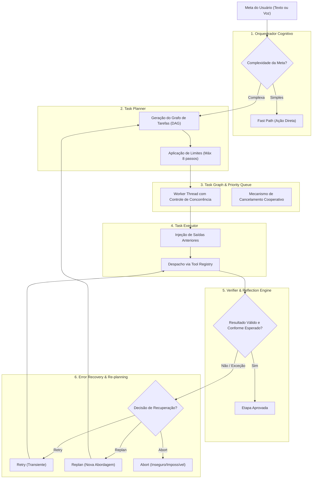

# ARQUITETURA DO AGENTE AUTÔNOMO (AGENT_ARCHITECTURE.md)

Este documento especifica o design da arquitetura cognitiva do agente autônomo ULTRON, detalhando os módulos de orquestração, planejamento em grafo (DAG), execução sequencial, verificação reflexiva e recuperação dinâmica de erros.

---

## 1. Visão Geral: Reatividade versus Deliberação

O ULTRON opera com dois modos cognitivos distintos:

1. **Modo Reativo (Fast Path):**
   - Para comandos diretos, atômicos e imediatos (ex.: "que horas são?", "aumente o volume para 50%", "abra o navegador", "está chovendo?").
   - O comando é despachado diretamente para a ferramenta correspondente sem overhead de planejamento, com resposta em menos de 500ms.
2. **Modo Deliberativo (Slow Path / Autonomous Agent):**
   - Para metas complexas, em múltiplas etapas ou que exijam pesquisa, síntese e verificação (ex.: "pesquise as notícias de semicondutores, crie um relatório em PDF com os gráficos, envie para meu e-mail e me avise quando terminar").
   - Aciona o núcleo do agente autônomo com decomposição de tarefas, fila com prioridades, execução em grafo e verificação de resultados.

---

## 2. Componentes da Arquitetura do Agente



---

## 3. Especificação dos Componentes

### 3.1 Orquestrador Cognitivo (Cognitive Orchestrator)
- **Função:** Determinar a rota de execução com base na semântica da requisição.
- **Diferenciação do Estado Atual:** Elimina as mais de 500 linhas de regex em [main.py](file:///d:/Downloads/ultron/Ultron/main.py#L2029), substituindo-as por classificação estruturada via IA com resposta de baixa latência (Gemini Flash ou Ollama local).

### 3.2 Planejador de Metas (Task Planner)
- **Função:** Decompor a meta em nós interdependentes representados como um **Grafo Acíclico Dirigido (DAG)**.
- **Estrutura Canônica de um Passo:**
  ```json
  {
    "step_id": 1,
    "tool": "web_search",
    "description": "Pesquisar avanços recentes em arquitetura RISC-V",
    "parameters": {"query": "RISC-V architecture breakthroughs 2026"},
    "depends_on": [],
    "critical": true,
    "expected_output": "Lista de artigos com fontes e números"
  }
  ```
- **Regras Absolutas do Planejador:**
  1. Máximo de 8 passos por meta para evitar loops infinitos.
  2. Nenhuma geração de script Python livre como passo padrão (`generated_code` extinto).
  3. Toda etapa deve depender explicitamente dos passos anteriores caso precise de seus dados.

### 3.3 Grafo de Tarefas e Fila com Prioridade (Task Queue)
- **Evolução de:** [agent/task_queue.py](file:///d:/Downloads/ultron/Ultron/agent/task_queue.py).
- **Recursos Mantidos e Expandidos:**
  - Níveis de prioridade: `HIGH` (comandos de voz urgentes), `NORMAL` (tarefas de background), `LOW` (indexações periódicas).
  - Cancelamento atômico: O usuário pode dizer a qualquer momento "cancele a tarefa" ou clicar em Cancelar no HUD, setando a flag cooperativa `cancel_flag.set()`, que encerra a thread de trabalho com segurança.

### 3.4 Executor com Injeção de Contexto (Task Executor)
- **Evolução de:** [agent/executor.py](file:///d:/Downloads/ultron/Ultron/agent/executor.py).
- **Mecanismo de Injeção:** Os resultados de passos concluídos são propagados diretamente para os parâmetros dos passos dependentes (ex.: o texto retornado pela busca web é automaticamente injetado no campo `content` da ferramenta `pdf_document`).
- **Segurança:** O executor só despacha chamadas reconhecidas pelo `Tool Registry` e aprovadas pelo `Execution Guard`.

### 3.5 Motor de Verificação e Reflexão (Verifier & Reflection)
- **Objetivo:** O agente não deve assumir cegamente que uma ferramenta funcionou só porque não lançou exceção.
- **Funcionamento:**
  - Após a execução de uma etapa crítica, o `Verifier` confere se o arquivo foi realmente criado no disco (`file.exists()`), se o PDF tem mais de 0 bytes, ou se a busca trouxe resultados concretos.
  - Se o resultado for vazio ou inválido, o passo é marcado como falho mesmo que a biblioteca não tenha dado erro.

### 3.6 Motor de Recuperação de Erros (Error Recovery)
- **Evolução de:** [agent/error_handler.py](file:///d:/Downloads/ultron/Ultron/agent/error_handler.py).
- **Árvore de Decisão:**
  - **`RETRY`:** Para falhas de rede, timeouts ou arquivos temporariamente travados pelo Windows (máximo de 2 tentativas).
  - **`SKIP`:** Se o passo com falha não for marcado como `critical=True` (ex.: falha ao buscar cotação de ação durante resumo matinal).
  - **`REPLAN`:** Se a abordagem falhou estruturalmente, gera um plano alternativo (ex.: se a raspagem Playwright falhar por bloqueio de captcha, replaneja para busca alternativa via DuckDuckGo API).
  - **`ABORT`:** Se a tarefa for impossível (ex.: credenciais inválidas) ou violar a política de segurança, interrompe o fluxo e informa o usuário com clareza.
