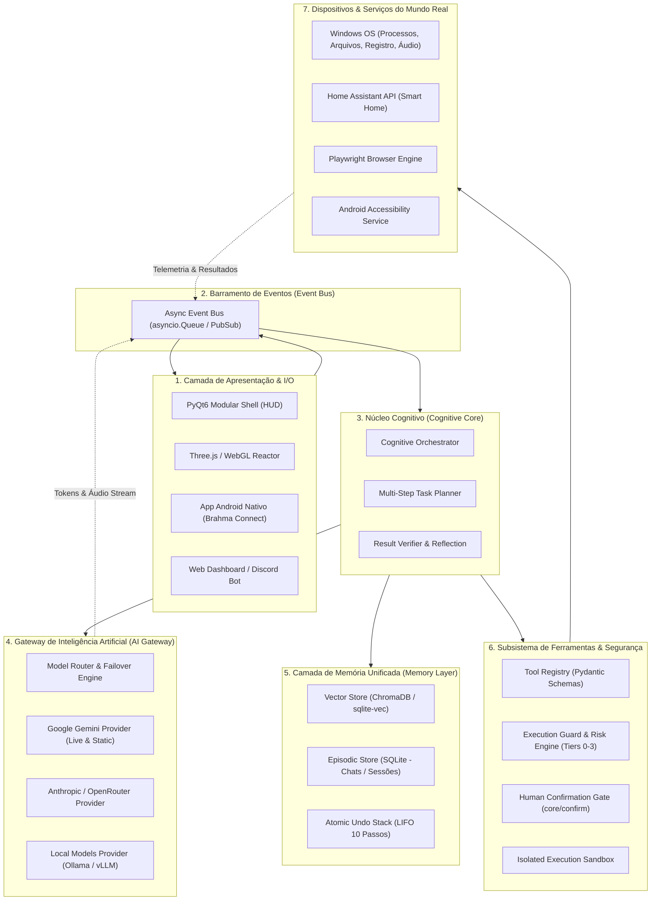

# ARQUITETURA TÉCNICA DO SISTEMA ULTRON (ARCHITECTURE.md)

Este documento descreve a topologia arquitetural do projeto ULTRON, contrastando o **estado arquitetural atual** com a **arquitetura de destino**, definindo as fronteiras de responsabilidade, subsistemas e o fluxo de dados canônico.

---

## 1. Visão Geral da Arquitetura Atual

O sistema atual opera sob um modelo legado monolítico e fortemente acoplado, derivado do protótipo Brahma AI, estruturado em torno de dois arquivos principais hipertrofiados:

```text
┌────────────────────────────────────────────────────────────────────────┐
│                        MONÓLITO DE INTERFACE                           │
│              ui.py (14.329 linhas - 609 KB em arquivo único)           │
│                                                                        │
│  - Widgets de UI PyQt6 e QWebEngineView (Three.js background)          │
│  - Chamadas diretas de subprocessos e psutil                           │
│  - Captura e renderização de vídeo MediaPipe                           │
│  - Armazenamento em memória de conversas e telemetria                  │
│  - Acoplamento com sons, bot do Discord e banco SQLite                 │
└───────────────────────────────────┬────────────────────────────────────┘
                                    │ Callbacks mútuos / Thread locks
┌───────────────────────────────────▼────────────────────────────────────┐
│                         MONÓLITO DE BACKEND                            │
│             main.py (4.784 linhas - 227 KB em arquivo único)           │
│                                                                        │
│  - BrahmaLive: classe central monolítica de controle                   │
│  - Loop de áudio PCM 16kHz in / 24kHz out via sounddevice              │
│  - WebSocket direto com Google Gemini Live Audio API                   │
│  - Mais de 1.250 linhas de TOOL_DECLARATIONS embutidas                 │
│  - Mais de 500 linhas de heurísticas regex em _on_text_command         │
│  - Despacho imperativo de 40+ ferramentas locais                       │
│  - Monitor de área de transferência, boot sentry e logs                │
└──────────────────┬───────────────────────────────┬─────────────────────┘
                   │                               │
       ┌───────────▼───────────┐       ┌───────────▼───────────┐
       │   dashboard/server    │       │ brahma_connect/server │
       │  FastAPI (Porta 8000) │       │  FastAPI (Porta 8765) │
       │  WebSocket + AES-256  │       │   WebSocket Android   │
       └───────────────────────┘       └───────────────────────┘
```

### 1.1 Principais Deficiências do Estado Atual
- **Acoplamento Extremo:** A interface gráfica não se limita a renderizar estado; ela dispara threads de negócio, executa comandos do sistema e manipula bancos de dados diretamente.
- **Roteamento Triplo e Descoordenado:**
  1. *Voz:* Chega ao Gemini Live via WebSocket; as ferramentas são acionadas via `tool_call`.
  2. *Texto:* Interceptado por dezenas de expressões regulares em `_on_text_command()` antes de qualquer avaliação de modelo.
  3. *Agente:* Fila separada em `agent/task_queue.py` acionada apenas quando o comando invoca `agent_task`.
- **Servidores Web Redundantes:** Dois processos ASGI FastAPI distintos são executados simultaneamente em segundo plano nas portas 8000 e 8765.
- **Insegurança de Execução:** Execução de scripts gerados por IA sem isolamento (sandbox) no host via `subprocess.run([sys.executable, ...])`.

---

## 2. Arquitetura de Destino do ULTRON

A arquitetura de destino adota uma abordagem de **camadas concêntricas desacopladas**, integradas através de um **Barramento de Eventos Assíncrono (Event Bus)**, garantindo que nenhum subsistema acesse detalhes internos de outro.



---

## 3. Especificação das Camadas da Arquitetura Alvo

### 3.1 Camada 1: Apresentação & I/O (UI Layer)
- **Responsabilidade:** Renderizar a interface holográfica futurista, capturar entradas do usuário e exibir feedback visual/sonoro.
- **Princípio:** A UI torna-se puramente reativa (*dumb view*). Ela emite eventos no `Event Bus` (ex.: `UserTextInputEvent`, `AudioChunkCapturedEvent`, `DeviceClickedEvent`) e assina eventos de estado (ex.: `AssistantStateChangedEvent`, `LogMessageEmittedEvent`, `AudioPlaybackStreamEvent`).
- **Composição Modular:**
  - `ui/theme.py`: Definições estritas de paleta, gradientes e estilos.
  - `ui/views/`: Telas individuais (Chat, Dashboard, Dispositivos, Configurações).
  - `ui/overlays/`: Janelas modais (Confirmação, Lembretes, Análise de Tela).
  - `ui/web_view.py`: Hospedagem do reator 3D em Three.js/WebGL sem scripts inline quebrados.

### 3.2 Camada 2: Barramento de Eventos (Event Bus)
- **Responsabilidade:** Desacoplar produtores de consumidores de mensagens em tempo de execução.
- **Implementação:** Baseado em corrotinas assíncronas (`asyncio`) com tipagem estrita (dataclasses).
- **Tipos de Eventos Principais:**
  - `AudioInputEvent`: Fluxo contínuo de PCM do microfone.
  - `AudioOutputEvent`: Fluxo contínuo de PCM do modelo para os alto-falantes.
  - `UserCommandEvent`: Comando de texto ou transcrição de fala validada.
  - `ToolExecutionRequestEvent`: Solicitação de acionamento de ferramenta.
  - `ToolExecutionResultEvent`: Retorno de execução de uma ação.
  - `StateTransitionEvent`: Mudança de estado do assistente (LISTENING, THINKING, EXECUTING, SPEAKING).

### 3.3 Camada 3: Núcleo Cognitivo (Cognitive Core)
- **Responsabilidade:** Interpretação semântica, deliberação, orquestração e planejamento de tarefas.
- **Componentes:**
  - **Cognitive Orchestrator:** Avalia se o input é um comando imediato, uma conversa social ou uma tarefa complexa de múltiplos passos.
  - **Planner:** Decompõe metas complexas em um Grafo Acíclico Dirigido (DAG) de etapas com dependências claras.
  - **Task Queue:** Fila com gestão de prioridade e suporte a cancelamento atômico.
  - **Verifier & Reflection Engine:** Analisa o retorno de cada etapa antes de dá-la por concluída ou responder ao usuário, disparando replanejamento se o resultado divergirem da expectativa.

### 3.4 Camada 4: Gateway de IA (AI Gateway)
- **Responsabilidade:** Isolar todo o ecossistema de dependências de provedores de IA específicos.
- **Recursos Obrigatórios:**
  - **Provedores Suportados:** Google Gemini (SDK `google-genai`), Anthropic Claude, OpenAI, OpenRouter e Ollama local.
  - **Failover Automático:** Se a nuvem primária estiver indisponível ou retornar erro de cota (HTTP 429/503), o gateway faz failover transparente para modelos secundários ou para o LLM local.
  - **Streaming Unificado:** Interface padronizada para streaming de áudio bidirecional e streaming de texto com chunks unificados.
  - **Cache e Controle de Cotas:** Rastreamento de tokens consumidos, custos e cooldowns de rate-limit.

### 3.5 Camada 5: Memória Unificada (Memory Layer)
- **Responsabilidade:** Gerenciar a retenção de curto, médio e longo prazo do assistente.
- **Estrutura:**
  - **Memória Semântica:** Indexação em banco vetorial local (ChromaDB ou `sqlite-vec`) com embeddings gerados localmente ou via API, permitindo busca contextual por similaridade de cosseno.
  - **Memória Episódica:** Histórico completo de conversas estruturado em SQLite com particionamento por data e resumos automáticos.
  - **Memória de Trabalho:** Gerenciador do budget de contexto do prompt (mantendo o assistente ágil e dentro dos limites de janela).
  - **Pilha de Desfazer (Undo Stack):** Registro LIFO de callbacks reversíveis para até 10 ações do sistema.

### 3.6 Camada 6: Ferramentas & Segurança (Tool Registry & Execution Guard)
- **Responsabilidade:** Registrar, validar, autorizar e executar com segurança qualquer intervenção no ambiente operacional.
- **Componentes:**
  - **Tool Registry:** Catálogo tipado onde cada ação define seus esquemas via Pydantic e é convertida dinamicamente para os formatos exigidos por cada provedor de IA.
  - **Execution Guard:** Interceptor que classifica a ação em níveis de risco (Tier 0 a Tier 3). Operações Tier 3 (irreversíveis/críticas) são bloqueadas até que haja validação explícita no portal de confirmação humana (`core/confirm.py`).
  - **Sandbox:** Isolamento de comandos de terminal e scripts Python gerados dinamicamente em contêineres ou processos restritos sem acesso administrativo.

### 3.7 Camada 7: Dispositivos & Serviços (System Integrations)
- **Responsabilidade:** Conectar o assistente ao mundo real.
- **Componentes:**
  - **Windows Native Services:** Gestão de janelas, brilho, volume, telemetria de hardware e atalhos.
  - **Home Assistant Client:** Integração com a API WebSocket/REST do Home Assistant para automação residencial unificada de milhares de dispositivos.
  - **Mobile Gateway:** Comunicação com o aplicativo Android para notificações, localização e comandos remotos.
  - **Browser Engine:** Navegação e extração web com Playwright isolado.

---

## 4. Matriz de Transição Arquitetural

| Dimensão | Arquitetura Atual | Arquitetura Alvo (ULTRON) |
| :--- | :--- | :--- |
| **Padrão Arquitetural** | Monólito de dois arquivos gigantes (`ui.py` + `main.py`) | Camadas desacopladas guiadas por Event Bus assíncrono |
| **Comunicação entre Módulos**| Chamadas diretas de métodos e mutação de variáveis globais | Mensageria assíncrona com eventos tipados |
| **Dependência de IA** | Amarrada diretamente a nomes de modelos de um provedor | AI Gateway agnóstico a modelos e com failover local |
| **Execução de Código** | Insegura (`subprocess.run` direto no host com privilégios) | Sandboxed com validação de AST e autorização de risco |
| **Recuperação de Memória** | Busca por palavras-chave com regex simples em JSON | Banco vetorial semântico híbrido + SQLite episódico |
| **Smart Home** | Mocks estáticos para a maioria dos fabricantes | Integração nativa e oficial com Home Assistant |
| **Interface com SO** | Macros de coordenadas cegas com PyAutoGUI e sleep | UI Automation (UIA) nativa do Windows e APIs formais |
| **Portabilidade de Rede** | Dois servidores FastAPI independentes (8000 e 8765) | Um único gateway ASGI unificado e protegido |
