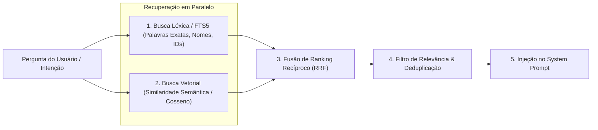

# ARQUITETURA DO SISTEMA DE MEMÓRIA (MEMORY_ARCHITECTURE.md)

Este documento especifica a arquitetura da camada de memória do assistente pessoal ULTRON, abrangendo a retenção episódica, semântica, preferências, contexto de projetos, ciclo de consolidação e o mecanismo híbrido de recuperação.

---

## 1. Visão Geral da Camada de Memória

A memória do ULTRON é projetada para resolver a maior fraqueza dos assistentes convencionais: a amnésia entre sessões e a dependência de correspondência estrita de palavras-chave.

```text
┌────────────────────────────────────────────────────────────────────────┐
│                        ARQUITETURA DE MEMÓRIA                          │
├────────────────────────────────────────────────────────────────────────┤
│ 1. MEMÓRIA OPERACIONAL / CONTEXTO IMEDIATO (RAM / Context Window)      │
│    - Mensagens do turno atual                                          │
│    - Contexto da janela em primeiro plano (core/window_context.py)     │
│    - Pilha de Desfazer de 10 passos (core/undo.py)                     │
│    - Orçamento estrito de tokens do System Prompt                      │
├────────────────────────────────────────────────────────────────────────┤
│ 2. MEMÓRIA EPISÓDICA (SQLite - config/workspace_store.sqlite3)         │
│    - Histórico sequencial de conversas (tabela messages)               │
│    - Sessões e metadados de chats (tabela conversations)               │
│    - Resumos narrativos de conversas anteriores                        │
├────────────────────────────────────────────────────────────────────────┤
│ 3. MEMÓRIA SEMÂNTICA & FATOS DE LONGO PRAZO (Vector Store + JSON)      │
│    - Fatos sobre o dono (nome, família, profissão, gostos)             │
│    - Histórico e especificações de projetos em andamento               │
│    - Embeddings vetoriais locais para busca por similaridade semântica │
├────────────────────────────────────────────────────────────────────────┤
│ 4. MEMÓRIA COMPORTAMENTAL / REGRAS (core/learned_rules.py)             │
│    - Diretrizes explícitas do usuário (ex.: falar sempre em pt-BR)     │
│    - Hábitos e correções aprendidas                                    │
└────────────────────────────────────────────────────────────────────────┘
```

---

## 2. Tipologias de Memória

### 2.1 Memória Episódica (Episodic Memory)
- **Objetivo:** Registrar o "quando" e o "o que aconteceu" em cada sessão.
- **Armazenamento:** Banco relacional SQLite com suporte a WAL mode (`workspace_store.sqlite3`).
- **Campos Principais:** `conversation_id`, `role` (user/assistant), `content`, `timestamp`, `tokens`, `attachments`.
- **Mecanismo de Resumo:** A cada fechamento de sessão ou após acúmulo de mensagens, um modelo de IA gera um resumo condensado em 1-2 sentenças ("Ontem você estava desenvolvendo o módulo de áudio do ULTRON..."), preservando continuidade sem sobrecarregar o histórico bruto.

### 2.2 Memória Semântica (Semantic Memory)
- **Objetivo:** Reter fatos duradouros independentemente de quando foram ditos.
- **Categorias Canônicas:**
  - `identity`: Nome, data de nascimento, cidade, profissão, idioma preferido.
  - `preferences`: Cores, alimentos, músicas, estilos de código, hábitos.
  - `projects`: Arquitetura, repositórios, metas ativas e escopo de projetos em desenvolvimento.
  - `relationships`: Pessoas mencionadas (família, amigos, colegas de equipe).
  - `wishes`: Desejos futuros, planos de viagem, aquisições planejadas.
  - `notes`: Observações gerais e anotações permanentes.

### 2.3 Memória Comportamental e Regras
- **Objetivo:** Garantir que preferências de interação nunca sejam esquecidas.
- **Exemplo Real ([config/identity.json](file:///d:/Downloads/ultron/Ultron/config/identity.json)):**
  > "Falar sempre em português Brasileiro, me chamar sempre de mestre ou senhor, sempre ao ler alguma coisa em outra língua (...) traduzir para o português."
- **Prioridade:** Estas regras são fixadas no bloco inegociável do System Prompt e possuem precedência sobre preferências genéricas.

---

## 3. Mecanismo de Recuperação Híbrido (Hybrid Retrieval Engine)

O sistema atual depende exclusivamente da função `search_memory` em [memory/memory_manager.py](file:///d:/Downloads/ultron/Ultron/memory/memory_manager.py#L442), baseada em casamento léxico de strings com regex.

A arquitetura de destino adota uma **Recuperação Híbrida em Duas Vias**:



1. **Via Léxica (FTS5 / SQLite):** Ideal para localizar códigos de produtos, nomes próprios, datas ou termos exatos.
2. **Via Vetorial (ChromaDB / sqlite-vec):** Gera embeddings de 384 a 768 dimensões para localizar conceitos sinônimos (ex.: uma busca por "automóvel" encontra "comprei um carro ontem").
3. **Fusão (RRF - Reciprocal Rank Fusion):** Combina as pontuações de ambas as vias para gerar um ranking final calibrado.

---

## 4. Ciclo de Vida da Memória (Memory Lifecycle)

O ciclo de vida da memória opera em segundo plano de forma não bloqueante para a conversação:

```text
Entrada e Resposta do Turno
            │
            ▼
[Filtro de Relevância - Stage 1] ──(Não contém fatos?)──► Descarte imediato
            │
            │ (Contém fatos potenciais)
            ▼
[Extrator Estruturado - Stage 2]
            │ Gera JSON estruturado com categoria e valor
            ▼
[Validação e Deduplicação]
            │ Verifica se o fato já existe ou atualiza timestamp
            ▼
[Persistência e Geração de Embeddings]
            │ Gravação atômica em SQLite / Vector Store
            ▼
[Consolidação Periódica (Compaction)]
            │ Remove entradas obsoletas e mantém o store limpo
```

---

## 5. Orçamento da Janela de Contexto (Context Budgeting)

Para manter a latência de primeiro token baixa e não sobrecarregar o modelo, o prompt do sistema é rigorosamente dividido em cotas:

| Bloco de Contexto | Cota Máxima de Caracteres | Função |
| :--- | :--- | :--- |
| **Core Persona & Instruções** | ~800 caracteres | Identidade do ULTRON, postura profissional e regra de português. |
| **Regras Comportamentais do Usuário**| ~500 caracteres | Diretrizes salvas em `identity.json` e `learned_rules.py`. |
| **Memória Semântica Relevante (Top-K)**| ~900 caracteres | Fatos resgatados dinamicamente via busca híbrida para a tarefa atual. |
| **Status Operacional do Sistema** | ~400 caracteres | Janela ativa, nível de bateria, dispositivos conectados. |
| **TOTAL DO CABEÇALHO** | **< 2.600 caracteres** | **Garante resposta quase instantânea no streaming.** |
