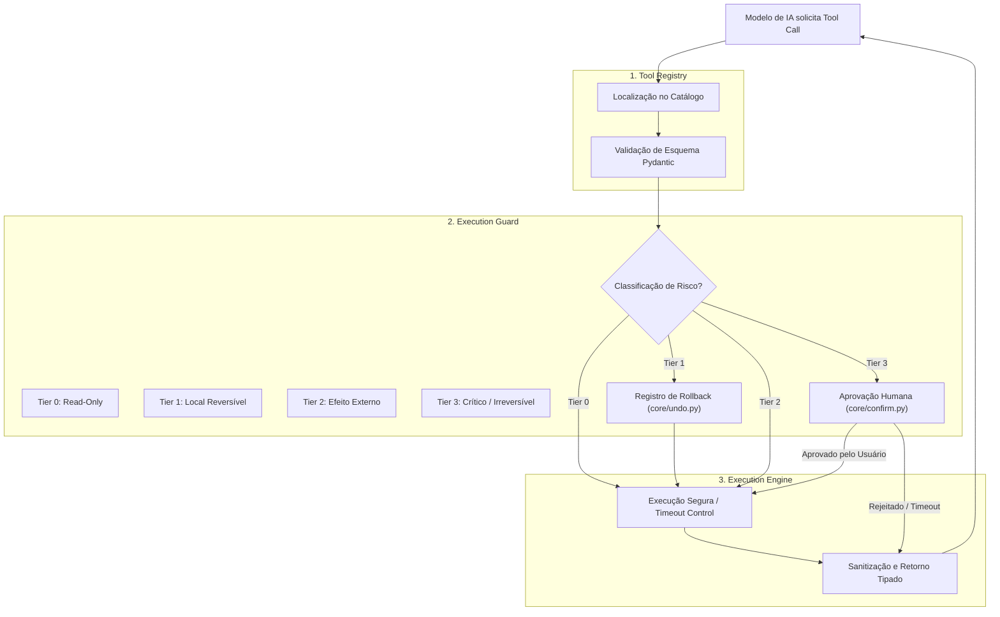

# ARQUITETURA DE FERRAMENTAS E EXECUÇÃO SEGURA (TOOL_ARCHITECTURE.md)

Este documento especifica o design do **Tool Registry**, o mecanismo de **Classificação de Risco (Risk Tiering)** e a camada de **Execution Guard** do projeto ULTRON.

---

## 1. O Problema da Arquitetura Atual de Ferramentas

No estado atual do código:
1. Mais de 1.250 linhas em [main.py](file:///d:/Downloads/ultron/Ultron/main.py#L620) contêm uma lista monolítica de dicionários manuais (`TOOL_DECLARATIONS`) acoplada à sintaxe do Gemini.
2. [agent/planner.py](file:///d:/Downloads/ultron/Ultron/agent/planner.py#L36) duplica essas descrições em formato de texto livre para outro modelo.
3. Não há validação de tipagem em tempo de compilação ou execução: os parâmetros chegam como `dict` genérico e quebram se uma chave estiver ausente.
4. Ferramentas perigosas (como encerrar processos, deletar arquivos ou navegar na web) são executadas com a mesma facilidade que consultas de clima.

---

## 2. A Nova Arquitetura: Tool Registry & Execution Guard

A arquitetura de destino adota uma separação rigorosa entre **Definição**, **Validação de Risco**, **Autorização** e **Execução**:



---

## 3. Especificação do Tool Registry

Cada ferramenta do ULTRON será uma classe herdeira de `BaseTool` ou função tipada contendo metadados estritos:

### 3.1 Contrato da Ferramenta (`BaseTool`)
```python
from pydantic import BaseModel
from typing import Any, Callable, Type
from enum import Enum

class RiskTier(Enum):
    TIER_0_READ_ONLY = "tier_0_read_only"
    TIER_1_LOCAL_REVERSIBLE = "tier_1_local_reversible"
    TIER_2_EXTERNAL_EFFECT = "tier_2_external_effect"
    TIER_3_CRITICAL_IRREVERSIBLE = "tier_3_critical_irreversible"

class ToolMetadata(BaseModel):
    name: str
    description: str
    category: str
    risk_tier: RiskTier
    timeout_seconds: float = 30.0
    supports_undo: bool = False
    requires_network: bool = False

class BaseTool:
    metadata: ToolMetadata
    params_schema: Type[BaseModel]

    async def execute(self, params: BaseModel, context: Any) -> Any:
        raise NotImplementedError
```

### 3.2 Exportação Agnóstica de Esquemas
O `Tool Registry` é responsável por traduzir automaticamente os esquemas Pydantic para os formatos exigidos por qualquer motor de IA:
- **Google Gemini:** `google.genai.types.FunctionDeclaration`.
- **OpenAI / OpenRouter:** Formato `{"type": "function", "function": {...}}`.
- **Anthropic Claude:** Formato `{"name": ..., "description": ..., "input_schema": {...}}`.
- **Model Context Protocol (MCP):** Formato padrão JSON-RPC 2.0.

---

## 4. Matriz de Classificação de Risco das Ferramentas do ULTRON

| Ferramenta | Categoria | Nível de Risco | Política de Execução | Suporta Rollback? |
| :--- | :--- | :--- | :--- | :--- |
| `weather_report` | Informação | **Tier 0** | Automática imediata | Não (leitura) |
| `system_manager:status` | Telemetria | **Tier 0** | Automática imediata | Não (leitura) |
| `calendar_scheduler:list` | Calendário | **Tier 0** | Automática imediata | Não (leitura) |
| `web_search` | Busca | **Tier 0** | Automática imediata | Não (leitura) |
| `youtube_video:summarize` | Multimídia | **Tier 0** | Automática imediata | Não (leitura) |
| `computer_settings:volume` | Sistema | **Tier 1** | Automática com log | **Sim** (restaura volume) |
| `computer_settings:brightness`| Sistema | **Tier 1** | Automática com log | **Sim** (restaura brilho) |
| `desktop_organizer` | Arquivos | **Tier 1** | Automática com log | **Sim** (move de volta) |
| `file_controller:move/copy` | Arquivos | **Tier 1** | Automática com log | **Sim** (reverte cópia/movimento) |
| `send_message` | Comunicação | **Tier 2** | Alerta visual no HUD | Não |
| `google_workspace:send` | E-mail | **Tier 2** | Alerta visual no HUD | Não |
| `browser_control:click/type`| Web | **Tier 2** | Alerta visual no HUD | Não |
| `brahma_connect:command` | Mobile | **Tier 2** | Alerta visual no HUD | Não |
| `file_controller:delete` | Arquivos | **Tier 3** | **Bloqueio: Confirmação Humana** | Não (irreversível) |
| `system_manager:kill` | Processos | **Tier 3** | **Bloqueio: Confirmação Humana** | Não (irreversível) |
| `computer_settings:shutdown` | Energia | **Tier 3** | **Bloqueio: Confirmação Humana** | Não (irreversível) |
| `cmd_control:bash` | Terminal | **Tier 3** | **Bloqueio: Confirmação Humana** | Não (irreversível) |

---

## 5. Pipeline de Execução e Tolerância a Falhas

Todo disparo de ferramenta atravessa 6 fases consecutivas:

1. **Validação de Tipagem:** O `Pydantic` valida tipos e campos obrigatórios antes que qualquer código de ação seja iniciado.
2. **Avaliação de Risco:** O `Execution Guard` verifica o Tier da ferramenta. Se Tier 3, pausa a execução e aguarda confirmação modal no HUD por até 90 segundos.
3. **Controle de Timeout:** A ferramenta é executada em uma thread assíncrona com `asyncio.wait_for(timeout=...)`. Se ultrapassar o tempo limite, o processo é cancelado sem travar o assistente.
4. **Captura e Tratamento de Exceções:** Erros de sistema operacional (permissão negada, arquivo não encontrado, rede indisponível) são capturados e formatados em mensagens compreensíveis para que o modelo possa replanejar.
5. **Registro na Pilha de Desfazer:** Se a ferramenta for Tier 1 e tiver sucesso, seu callback de reversão é automaticamente empilhado em `core/undo.py`.
6. **Auditoria de Ações:** O histórico da ação (ferramenta, parâmetros sanitizados, duração e status) é gravado no log de auditoria.
